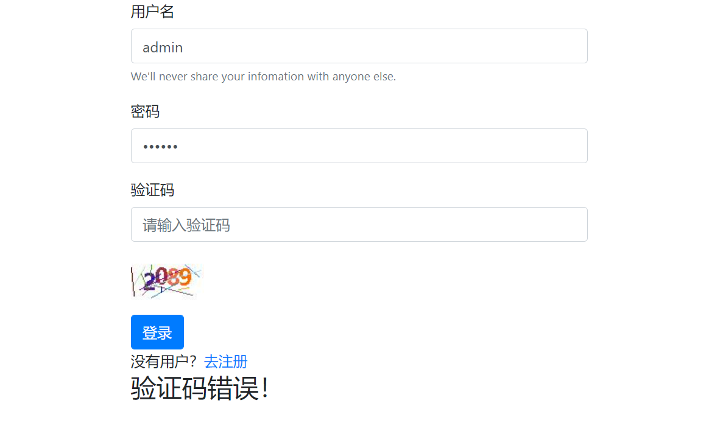
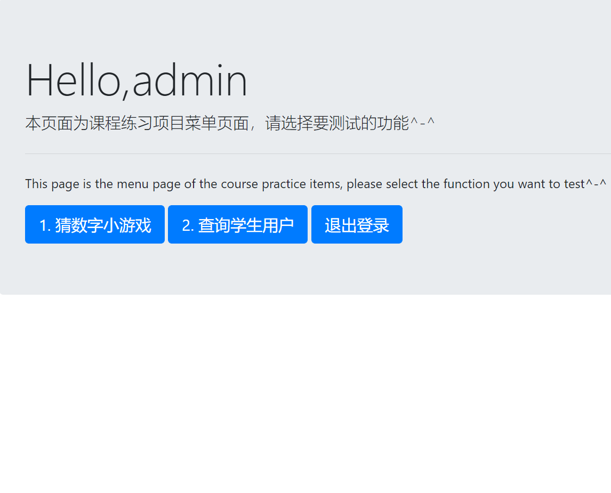
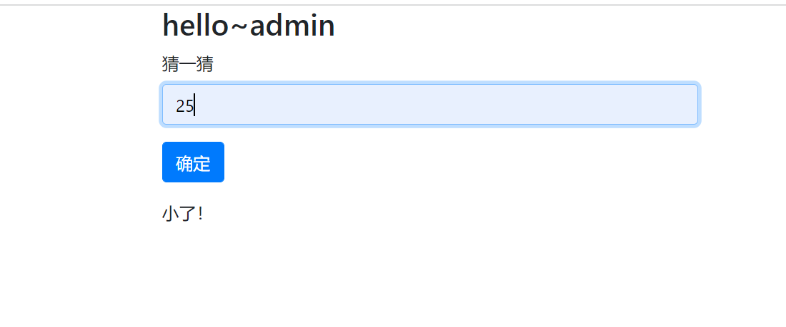
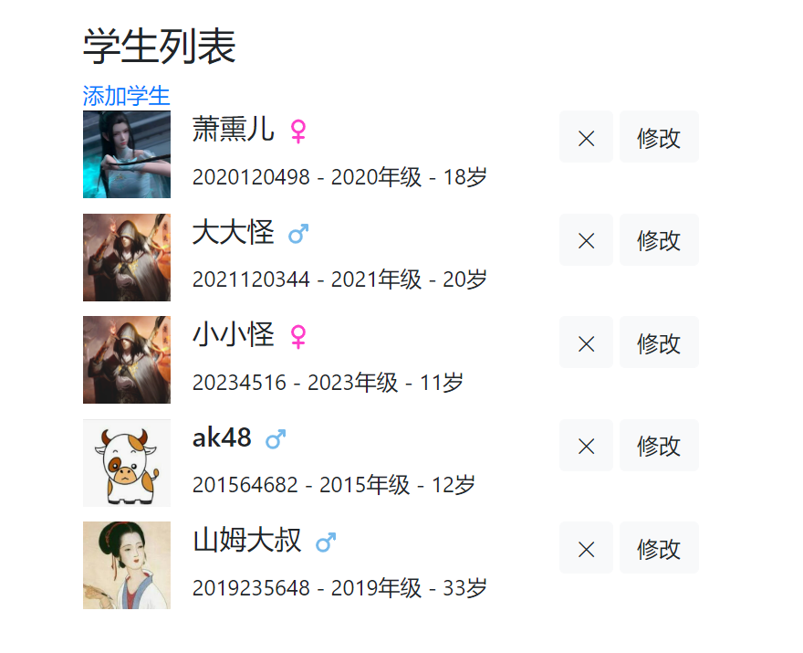
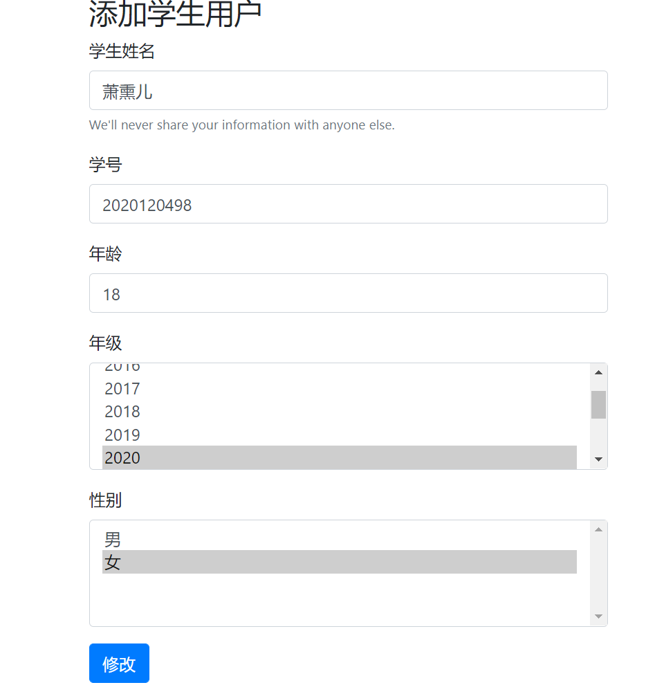
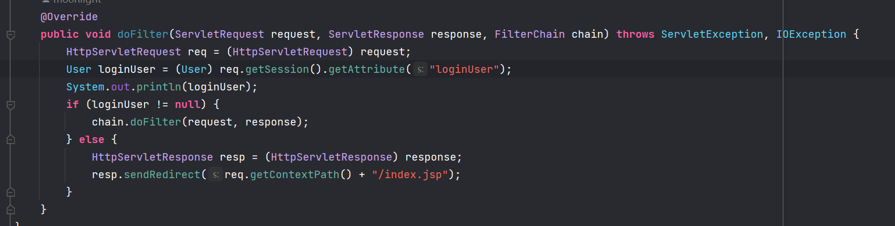
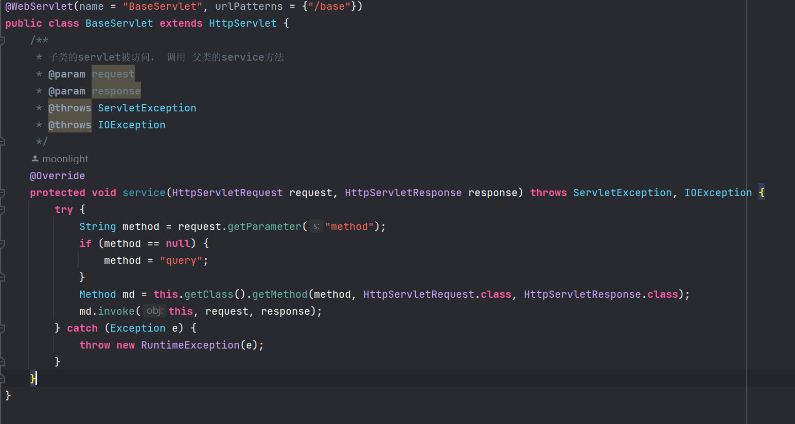

# JavaWeb_pratice
JAVAWEB课程练习作业
1.实现登录页面，添加验证码验证功能（看不清点击换一张），错误信息重定向回显

​	

2.进入菜单选择功能进入

	

2.模拟猜数字游戏

	

4.学生列表的查询

	

5.添加学生，并为学生随机赋予头像

	

6.修改学生信息（被修改学生信息回显）

	

7.删除学生信息（物理删除）

	

8.设置编码过滤器、登录过滤器，避免未登录用户进行数据操作。

9.设置BaseServlet重构Servlet代码。

	